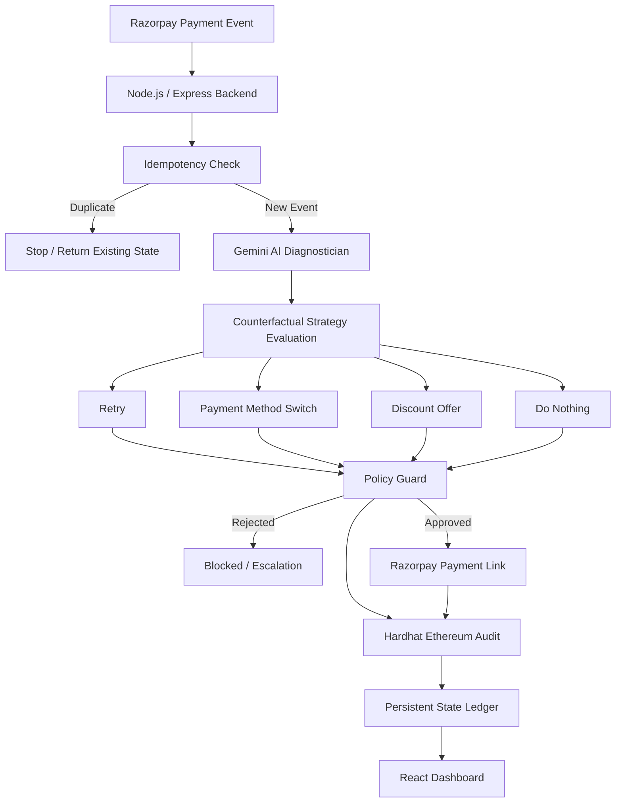

# RecoverAI

### AI-Powered Revenue Recovery Engine

> **Failed payment ≠ Lost revenue.**

RecoverAI is an AI-powered revenue recovery engine that analyzes failed payments, evaluates multiple recovery strategies, optimizes for **net recovered value**, and executes bounded recovery actions through Razorpay while maintaining deterministic policy controls, idempotency, and an auditable decision trail.

**Razorpay AI Buildathon 2026 — Track 03: AI Revenue Recovery**

**Razorpay × Gemini × Policy Guard × Blockchain Audit**

---

## Problem

Failed online payments represent potentially lost revenue for merchants.

Most payment recovery systems use generic approaches such as retrying the payment or sending a standard reminder. However, different payment failures may require different interventions.

The challenge is not only:

> **"Can we recover the payment?"**

but:

> **"What recovery action maximizes the merchant's net recovered value while staying within predefined limits?"**

RecoverAI addresses this decision-making problem.

---

## Solution

RecoverAI creates an automated recovery pipeline:

```text
Failed Payment
      ↓
AI Diagnosis
      ↓
Evaluate Multiple Strategies
      ↓
Net Recovery Optimization
      ↓
Policy Guard
      ↓
 ┌───────────────┐
 │               │
BLOCKED        APPROVED
 │               │
 ↓               ↓
Escalate     Razorpay Recovery
                │
                ↓
          Blockchain Audit
                │
                ↓
          Persistent Ledger
```

The system separates **AI intelligence** from **financial control**.

> **Gemini recommends. Policy Guard decides what is allowed.**

---

# Architecture



### Architecture Components

| Component                  | Technology              | Purpose                                 |
| :------------------------- | :---------------------- | :-------------------------------------- |
| **Frontend**               | React + Vite + Tailwind | Recovery command center                 |
| **Backend**                | Node.js + Express       | Workflow orchestration                  |
| **Payment Infrastructure** | Razorpay SDK            | Payment events & recovery links         |
| **AI Layer**               | Gemini                  | Failure diagnosis & strategy generation |
| **Safety Layer**           | Policy Guard            | Deterministic action validation         |
| **Audit Layer**            | Hardhat + Ethereum      | Decision audit anchor                   |
| **State Layer**            | JSON Ledger             | Persistent idempotency/state tracking   |

---

# AI Decision Engine

RecoverAI does not blindly ask an LLM to choose a discount.

Instead, the AI evaluates **multiple counterfactual recovery strategies**.

```text
Payment Failure
       ↓
Evaluate Alternatives
       ↓
 ┌──────────┬──────────┬──────────┬───────────┐
 │ Retry    │ Switch   │ Discount │ Do Nothing│
 └──────────┴──────────┴──────────┴───────────┘
       ↓
Expected Recovery
       ↓
Intervention Cost
       ↓
Expected Net Recovery
       ↓
Best Candidate
```

### Recovery Strategies

Depending on the payment context, RecoverAI can evaluate:

* Retry payment
* Suggest an alternative payment method
* Offer a bounded discount
* Take no action

### Optimization Objective

```text
Expected Net Recovery
=
Expected Recovery
-
Intervention Cost
```

The objective is to maximize **net recovered value**, rather than simply maximizing the number of recovered transactions.

---

# Policy Guard

AI-generated recommendations are never executed without validation.

The deterministic Policy Guard acts as a safety boundary between AI recommendations and financial actions.

### Example Policies

* Maximum allowed discount
* Minimum acceptable net recovery
* Allowed recovery strategies
* Escalation conditions
* Duplicate-event protection
* Bounded financial actions

### Decision Flow

```text
Gemini Recommendation
        ↓
   Policy Guard
        ↓
   ┌────┴────┐
   ↓         ↓
APPROVED   BLOCKED
   ↓         ↓
Execute    Escalate
```

This creates a clear separation:

> **AI = Intelligence**
> **Policy = Control**

The AI can identify an attractive recovery opportunity, but the final action must remain within deterministic merchant-defined constraints.

---

# Recovery Workflow

RecoverAI follows a controlled state machine:

```text
INGESTED
   ↓
DIAGNOSED
   ↓
APPROVED_BOUNDED
   ↓
LINK_ACTIVE
   ↓
SETTLED_RECOVERED
```

### Failure Path

```text
DIAGNOSED
    ↓
POLICY REJECTED
    ↓
BLOCKED / ESCALATED
```

This ensures that unsafe or invalid recommendations do not proceed directly to execution.

---

# Idempotency and Reliability

Payment systems can deliver the same event more than once.

RecoverAI prevents duplicate recovery actions by using the payment ID as an idempotency key.

```text
payment.failed
      ↓
Check Persistent Ledger
      ↓
Already Processed?
    /       \
  YES        NO
   ↓          ↓
 STOP      PROCESS
              ↓
       AI → Policy → Recovery
              ↓
        Update Ledger
```

A duplicate event does not trigger:

* Another Gemini decision
* Another recovery Payment Link
* Another blockchain audit transaction

The prototype uses a persistent JSON ledger to maintain processing state across server restarts.

---

# Blockchain Auditability

Approved recovery decisions are recorded on a local Ethereum testnet using Hardhat.

The audit layer records information such as:

```text
Payment ID
     +
Final Action
     +
Bounded Discount
     ↓
Blockchain Transaction
```

This provides a verifiable audit anchor for the recovery decision.

### Important

Blockchain is used for **decision auditability**, not as the payment processor.

Razorpay remains responsible for the payment and recovery transaction.

---

# Razorpay Integration

RecoverAI integrates with Razorpay for payment event ingestion and recovery execution.

### Payment Events

```text
Razorpay
    ↓
payment.failed
    ↓
RecoverAI
```

### Recovery Execution

After the Policy Guard approves an intervention:

```text
RecoverAI
    ↓
Razorpay Payment Link
    ↓
Customer Recovery Checkout
```

The prototype dynamically generates a Razorpay Payment Link based on the bounded recovery strategy.

---

# Frontend

The React frontend acts as the recovery command center.

It can display:

* Failed payment events
* AI-generated strategies
* Selected recovery action
* Policy status
* Recovery amount
* Blockchain transaction
* Recovery URL
* Processing state

The frontend communicates with the Express backend through REST APIs.

---

# Demo

The demo demonstrates the complete recovery workflow:

```text
Failed Payment
      ↓
Gemini Analysis
      ↓
Multiple Strategies
      ↓
Policy Guard Approval
      ↓
Blockchain Audit
      ↓
Razorpay Payment Link
```

### Demo Video

**[Add your Google Drive or YouTube demo link here]**

---

# Project Structure

```text
RecoverAI/
│
├── agents/
│   └── diagnostician.js
│
├── core/
│   └── policyGuard.js
│
├── contracts/
│   └── RecoverAIAudit.sol
│
├── frontend/
│   ├── src/
│   └── ...
│
├── server.js
├── fire.js
├── processed_payments.json
├── package.json
├── .env
└── README.md
```

---

# Tech Stack

### Frontend

* React
* Vite
* Tailwind CSS

### Backend

* Node.js
* Express.js

### AI

* Google Gemini

### Payments

* Razorpay SDK
* Razorpay Payment Links
* Razorpay Webhooks

### Blockchain

* Solidity
* Hardhat
* Ethereum

### State and Reliability

* Persistent JSON ledger
* Idempotency checks

---

# Getting Started

## 1. Clone the Repository

```bash
git clone <YOUR_REPOSITORY_URL>
cd RecoverAI
```

## 2. Install Dependencies

```bash
npm install
```

If the frontend has its own package:

```bash
cd frontend
npm install
cd ..
```

## 3. Configure Environment Variables

Create a `.env` file:

```env
RAZORPAY_KEY_ID=your_razorpay_key
RAZORPAY_KEY_SECRET=your_razorpay_secret
GEMINI_API_KEY=your_gemini_key
PORT=5000
```

**Never commit `.env` or API keys to GitHub.**

## 4. Start Hardhat

```bash
npx hardhat node
```

## 5. Deploy the Audit Contract

Deploy `RecoverAIAudit.sol` to the local Hardhat network and configure the deployed contract address in the backend.

## 6. Start the Backend

```bash
node server.js
```

Backend:

```text
http://localhost:5000
```

## 7. Start the Frontend

```bash
cd frontend
npm run dev
```

---

# Testing the Recovery Workflow

A simulated failed payment can be sent to:

```text
POST /api/recover
```

The Razorpay webhook endpoint is:

```text
POST /api/webhooks/razorpay
```

### Example Webhook Event

```json
{
  "event": "payment.failed",
  "payload": {
    "payment": {
      "entity": {
        "id": "pay_test_001",
        "amount": 10000,
        "currency": "INR",
        "status": "failed",
        "method": "card",
        "error_code": "BAD_REQUEST_ERROR"
      }
    }
  }
}
```

---

# Example Recovery Decision

For a failed payment of ₹100:

```text
AI evaluates:
    ↓
DISCOUNT_OFFER
    ↓
Discount: 5%
    ↓
Expected Recovery: ₹95
    ↓
Incentive Cost: ₹5
    ↓
Expected Net Recovery: ₹90
    ↓
Policy Guard: APPROVED
```

The approved decision is then connected to:

```text
Razorpay Recovery Link
        +
Blockchain Audit
        +
Persistent Ledger
```

---

# API Endpoints

| Method   | Endpoint                 | Description                                                 |
| :------- | :----------------------- | :---------------------------------------------------------- |
| **POST** | `/api/recover`           | Trigger a recovery workflow using a simulated payment event |
| **POST** | `/api/webhooks/razorpay` | Receive Razorpay webhook events                             |
| **GET**  | `/api/logs`              | Retrieve recovery workflow logs                             |

---

# Future Improvements

For production deployment, RecoverAI can be extended with:

* Production database instead of JSON state storage
* Redis or distributed idempotency
* Production blockchain or managed audit infrastructure
* Razorpay webhook signature verification
* Secure secret management
* Customer-specific recovery models
* Historical payment behavior
* Recovery outcome feedback loops
* A/B testing of recovery strategies
* Merchant analytics and recovery forecasting

---

# Why RecoverAI?

Traditional payment recovery asks:

> **"Should we retry the payment?"**

RecoverAI asks:

> **"Which intervention produces the highest expected net recovery while remaining within merchant-defined policies?"**

That difference turns payment recovery from a simple automation problem into an **AI-driven decision optimization problem**.

---

# Core Innovation

### Net Recovery Optimization + Controlled AI Execution

RecoverAI combines:

**AI Strategy Generation**
↓
**Economic Evaluation**
↓
**Deterministic Policy Enforcement**
↓
**Automated Razorpay Recovery**
↓
**Idempotent Execution**
↓
**Blockchain-backed Auditability**

---

# Built for Razorpay AI Buildathon 2026

**Track:** AI Revenue Recovery

**RecoverAI**

> **Recover Revenue. Protect Margins. Stay in Control.**

---

## Disclaimer

RecoverAI is a Buildathon prototype demonstrating an AI-assisted revenue recovery workflow.

Before production deployment, additional security, infrastructure, webhook verification, secret management, persistent database infrastructure, and production-grade audit infrastructure would be required.
